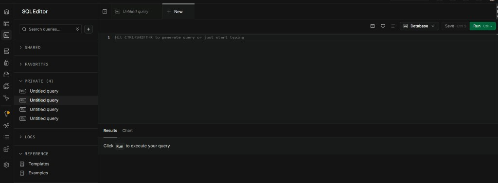

# MARARE

MARARE is a meeting-driven product documentation platform. Users create projects, run live meetings with AI assistance, generate structured documents from discussions, and optionally connect MCP integrations (Notion, Google Drive, GitHub).

**Stack:** Flask + Socket.IO backend · Vite + React frontend · Supabase (PostgreSQL)

---

## Prerequisites


| Tool             | Version                              |
| ---------------- | ------------------------------------ |
| Python           | 3.10+ recommended                    |
| Node.js          | 18+                                  |
| npm              | 9+                                   |
| Supabase project | [supabase.com](https://supabase.com) |


**Required services**

- **Supabase** — auth, database, project/meeting storage
- **OpenAI API key** — document generation, MVP/Vision agents, realtime features

**Optional**

- Google Cloud OAuth app — Google Drive MCP
- Notion OAuth — Notion MCP (registered automatically by the backend)
- Azure Speech (`VITE_KEY`, `VITE_REGION`) — speech-to-text in meetings

---


## Quick start


### 1. Clone and install

```bash
git clone <repository-url>
cd MARARE-MCP-skills

# Python
python -m venv venv
# Windows
venv\Scripts\activate
# macOS / Linux
source venv/bin/activate

pip install -r requirements.txt

# Frontend
npm install
```


### 2. Environment variables

Copy the example file and fill in your values:

```bash
cp .env.example .env
```

See [Environment variables](#environment-variables) below for what each key does. **Never commit** `.env` — it is listed in `.gitignore`.

**Minimum to run locally**


| Key                          | Where to get it                                                       |
| ---------------------------- | --------------------------------------------------------------------- |
| `VITE_KEY`                   | azure key                                                             |
| `VITE_REGION`                | azure region                                                          |
| `VITE_SUPABASE_URL`          | Supabase → Project Settings → API → Project URL                       |
| `VITE_SUPABASE_KEY`          | Supabase → Project Settings → API → `anon` `public` key               |
| `SUPABASE_SERVICE_ROLE_KEY`  | Supabase → Project Settings → API → `service_role` key (backend only) |
| `OPENAI_API_KEY`             | [platform.openai.com](https://platform.openai.com)                    |
| `TURN_USERNAME`              | Turn username for webrtc                                              |
| `TURN_CREDENTIAL`            | Turn CREDENTIAL for webrtc                                            |
| `GOOGLE_DRIVE_CLIENT_ID`     | Google OAuth client id                                                |
| `GOOGLE_DRIVE_CLIENT_SECRET` | Google OAuth client secret                                            |


### 3. Create Supabase database tables

> **Important:** Run these SQL scripts only on your **new** Supabase project, in order, without skipping any file.

**How to run each script**

1. Log in to [supabase.com](https://supabase.com) and open your project.
2. In the left sidebar: **SQL Editor** → **New query**.
3. Use the **copy** icon at the top-right of each SQL block below, paste into the editor, and click **Run**.
4. Wait until it completes successfully, then repeat for the next script (use a new query each time).

Paste into the large editor area (where it says *Hit CTRL+SHIFT+K to generate query or just start typing*), then click the green **Run** button in the top right:



**Run order (do not change)**

`001` → `002` → `003` → `004`

If scripts run out of order, inserts from the app or later scripts may fail because required tables and columns will not exist.

#### SQL 001 — schema (`001_marare_schema.sql`)

```sql
-- MARARE application schema (MongoDB replacement)
-- Run in Supabase SQL editor or via Supabase CLI.

create extension if not exists "pgcrypto";

create table if not exists public.projects (
  id uuid primary key default gen_random_uuid(),
  user_id text not null,
  name text not null,
  template_document jsonb,
  mvp_vision_template jsonb,
  created_at timestamptz not null default now()
);

create index if not exists idx_projects_user_id on public.projects (user_id);

create table if not exists public.generated_documents (
  id uuid primary key default gen_random_uuid(),
  user_id text not null,
  meeting_id text,
  project_id text not null,
  project_name text,
  template jsonb,
  generated_sections jsonb,
  undiscussed_topics jsonb default '[]'::jsonb,
  meeting_phase text,
  progress double precision default 0,
  timestamp timestamptz,
  team_data jsonb,
  source text,
  version integer not null default 1,
  version_created_at timestamptz,
  version_history jsonb not null default '[]'::jsonb,
  created_at timestamptz not null default now(),
  updated_at timestamptz not null default now()
);

create index if not exists idx_generated_documents_user_project
  on public.generated_documents (user_id, project_id, created_at desc);
create index if not exists idx_generated_documents_user_meeting
  on public.generated_documents (user_id, meeting_id, created_at desc);

create table if not exists public.meeting_summaries (
  id uuid primary key default gen_random_uuid(),
  user_id text not null,
  meeting_id text,
  project_id text,
  project_name text,
  summary_content text,
  timestamp timestamptz,
  team_data jsonb,
  version integer not null default 1,
  created_at timestamptz not null default now(),
  updated_at timestamptz not null default now()
);

create index if not exists idx_meeting_summaries_user_project
  on public.meeting_summaries (user_id, project_id, created_at desc);

create table if not exists public.meeting_mvpvisions (
  id uuid primary key default gen_random_uuid(),
  user_id text not null,
  meeting_id text,
  project_id text,
  project_name text,
  mvp text default '',
  vision text default '',
  timestamp timestamptz,
  version integer not null default 1,
  created_at timestamptz not null default now(),
  updated_at timestamptz not null default now()
);

create index if not exists idx_meeting_mvpvisions_user_project
  on public.meeting_mvpvisions (user_id, project_id, created_at desc);

create table if not exists public.mcp_configurations (
  id uuid primary key default gen_random_uuid(),
  user_id text not null,
  project_id text not null,
  provider text not null,
  configuration jsonb not null default '{}'::jsonb,
  created_at timestamptz not null default now(),
  updated_at timestamptz not null default now(),
  unique (user_id, project_id, provider)
);

create index if not exists idx_mcp_configurations_project
  on public.mcp_configurations (project_id, provider);

create table if not exists public.mcp_oauth_states (
  id uuid primary key default gen_random_uuid(),
  state text not null unique,
  provider text,
  project_id text not null,
  user_id text not null,
  payload jsonb not null default '{}'::jsonb,
  expires_at timestamptz not null,
  created_at timestamptz not null default now()
);

create index if not exists idx_mcp_oauth_states_expires_at
  on public.mcp_oauth_states (expires_at);

create table if not exists public.meeting_document_sessions (
  meeting_id text primary key,
  session_data jsonb not null default '{}'::jsonb,
  created_at timestamptz not null default now(),
  updated_at timestamptz not null default now()
);

create table if not exists public.meeting_admins (
  id uuid primary key default gen_random_uuid(),
  meeting_id text not null,
  user_id text,
  is_admin boolean not null default true,
  is_agent boolean not null default false,
  agent_name text,
  exp timestamptz,
  created_at timestamptz not null default now()
);

create index if not exists idx_meeting_admins_meeting
  on public.meeting_admins (meeting_id, is_admin);

create table if not exists public.project_reports (
  id uuid primary key default gen_random_uuid(),
  project_id text not null,
  user_id text,
  file_id text,
  metadata jsonb not null default '{}'::jsonb,
  created_at timestamptz not null default now()
);

create index if not exists idx_project_reports_project
  on public.project_reports (project_id);
```

#### SQL 002 — user map

```sql
-- Tracks MongoDB / legacy Supabase user ids and links them to new auth users by email.

create table if not exists public.migration_user_map (
  id uuid primary key default gen_random_uuid(),
  email text not null,
  legacy_user_id text not null,
  new_user_id text,
  linked_at timestamptz,
  created_at timestamptz not null default now(),
  unique (email),
  unique (legacy_user_id)
);

create index if not exists idx_migration_user_map_new_user
  on public.migration_user_map (new_user_id);

create table if not exists public.migration_project_map (
  id uuid primary key default gen_random_uuid(),
  legacy_project_id text not null,
  new_project_id uuid not null,
  legacy_user_id text not null,
  created_at timestamptz not null default now(),
  unique (legacy_project_id)
);

create index if not exists idx_migration_project_map_new
  on public.migration_project_map (new_project_id);
```

#### SQL 003 — meeting versioning (`003_meeting_versioning.sql`)

```sql
-- Meeting versioning: transcripts + document lineage

alter table public.generated_documents
  add column if not exists based_on_meeting_id text,
  add column if not exists based_on_document_id uuid;

create index if not exists idx_generated_documents_based_on_meeting
  on public.generated_documents (based_on_meeting_id);

create table if not exists public.meeting_transcripts (
  id uuid primary key default gen_random_uuid(),
  user_id text not null,
  meeting_id text not null,
  project_id text not null,
  project_name text,
  based_on_meeting_id text,
  entries jsonb not null default '[]'::jsonb,
  full_text text default '',
  created_at timestamptz not null default now(),
  updated_at timestamptz not null default now(),
  unique (user_id, meeting_id)
);

create index if not exists idx_meeting_transcripts_user_project
  on public.meeting_transcripts (user_id, project_id, created_at desc);

create index if not exists idx_meeting_transcripts_meeting
  on public.meeting_transcripts (meeting_id);
```

#### SQL 004 — meeting agenda (`004_meeting_agenda.sql`)

```sql
-- Persist meeting agenda for history display

alter table public.generated_documents
  add column if not exists meeting_agenda text;

alter table public.meeting_transcripts
  add column if not exists meeting_agenda text;

create index if not exists idx_generated_documents_meeting_agenda
  on public.generated_documents (user_id, project_id, meeting_agenda);
```

### 4. Google signup redirect URLs

Google **Continue with google** uses Supabase Auth (this is separate from Google Drive MCP). Add the URLs below or signup will fail after Google consent.

**A. Google Cloud Console**

1. Open [Google Cloud Console](https://console.cloud.google.com/) → **APIs & Services** → **Credentials**.
2. Open your **OAuth 2.0 Client ID** (Web application).
3. Under **Authorized redirect URIs**, add this (copy, then replace the project ref):

```
https://<YOUR_PROJECT_REF>.supabase.co/auth/v1/callback
```

`<YOUR_PROJECT_REF>` is the subdomain in `VITE_SUPABASE_URL`. Example: `https://abcdefgh.supabase.co` → use `https://abcdefgh.supabase.co/auth/v1/callback`.

**B. Supabase Auth URL configuration**

1. Open your project → **Authentication** → **URL Configuration**.
2. Set **Site URL** (local):

```
http://localhost:5173
```

3. Under **Redirect URLs**, add:

```
http://localhost:5173/**
http://localhost:5173/login
http://localhost:5173/reset-password
```

For production, set **Site URL** to your deployed frontend origin and add the same paths there (for example `https://your-domain.com/**`).

**C. Enable the Google provider**

1. **Authentication** → **Providers** → **Google**.
2. Enable it and paste the Google OAuth **Client ID** and **Client Secret**.

### 5. Run the application

**Terminal 1 — backend**

```bash
python api.py
```

Default port: `5000` (override with `PORT` in `.env`).

**Terminal 2 — frontend**

```bash
npm run dev
```

Vite dev server (usually `http://localhost:5173`) proxies API calls to the backend via `config/appUrls.json` and `VITE_SOCKET_URL`.

### 6. First use

1. Open the frontend URL in your browser.
2. **Register / log in** (email/password or **Continue with google** — see [Google signup redirect URLs](#4-google-signup-redirect-urls)).
3. **Create a project** and optionally configure document + MVP/Vision templates.
4. **Configure MCP** (optional): Project → MCP Configuration (Notion, Google Drive, GitHub).
5. **Start a meeting**, generate documents, end meeting — data saves to Supabase.
6. View meeting history and edit documents from the project UI.


## MCP configuration (Notion & Google Drive)

From a project page → **Configure MCP**:

1. **GitHub** — personal access token + username via `POST /mcp/configure`.
2. **Notion** — OAuth flow (`POST /mcp/oauth/notion/start`); no manual Notion client id in `.env` for project connect.
3. **Google Drive** — OAuth flow; requires `GOOGLE_DRIVE_CLIENT_ID` and `GOOGLE_DRIVE_CLIENT_SECRET` in backend `.env`.

Set document storage preference (Supabase vs Notion vs Drive):

- UI: MCP Configuration page, or
- API: `POST /mcp/document-storage-preference`


## License

See [LICENSE](./LICENSE).